# firebase-react-sample

## すること

1. React アプリから Firebase Realtime Database を利用

## 前提

- [Firebase:](https://firebase.google.com/)を利用するため Gooble アカウントを所有していること

- React アプリが構築できること(参考 node.js,npm,yarn のバージョン)
  ```
  $ node -v
  v14.15.1
  $ npm -v
  6.14.11
  $ yarn -v
  1.22.5
  $ npx -v
  6.14.11
  ```

## 公式ドキュメント

今回利用する Firebase の API キーについては公式のドキュメントを一読推奨

[Learn about using and managing API keys for Firebase](https://firebase.google.com/docs/projects/api-keys)

## 1. Firebase Realtime Database

### 準備(Firebase Realtime Database)

[Firebase](https://firebase.google.com/)を開き「コンソールへ移動」を押下


「プロジェクトを追加」を押下

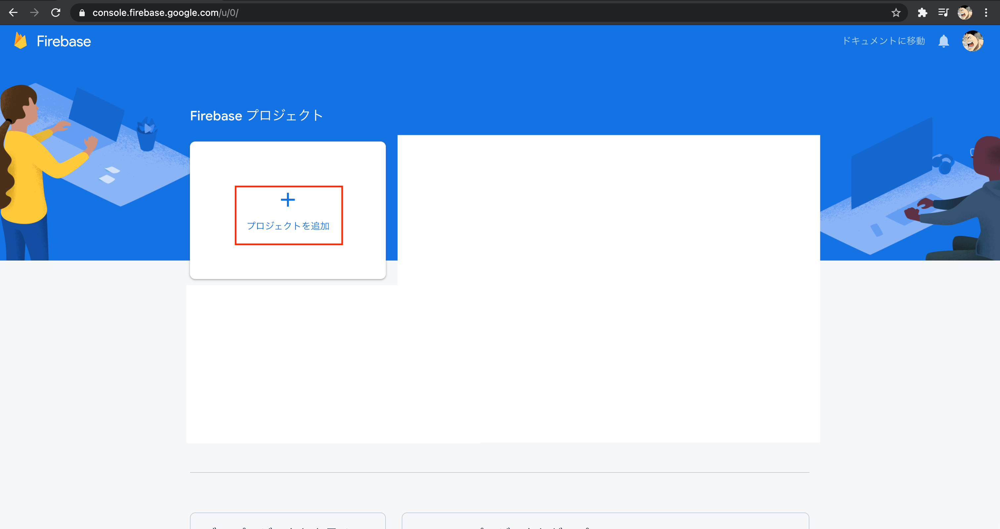

「プロジェクト名」を入力し「続行」を押下

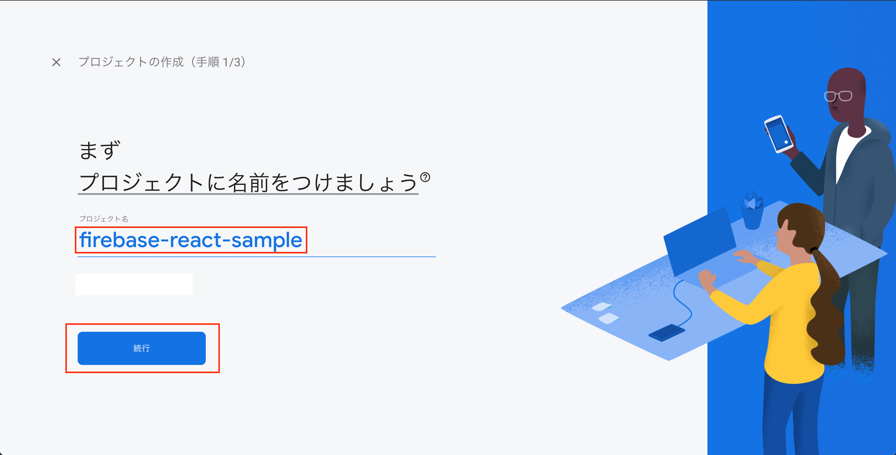

「アナリティクス」を無効(今回はサンプルコードのため)にし「プロジェクトを作成」を押下

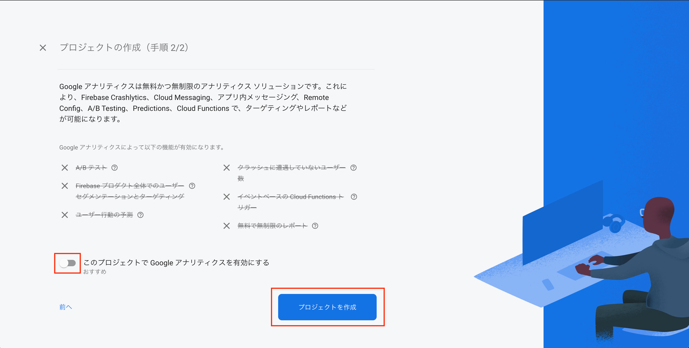

「続行」を押下

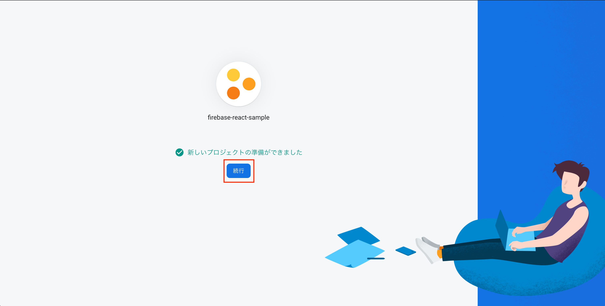

「Realtime Database」を押下

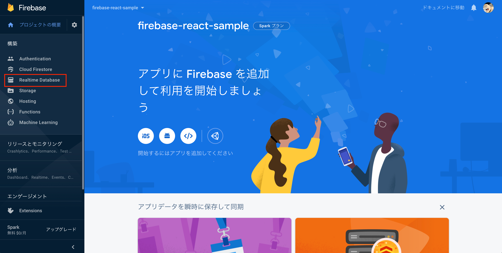

「データベースを作成」を押下

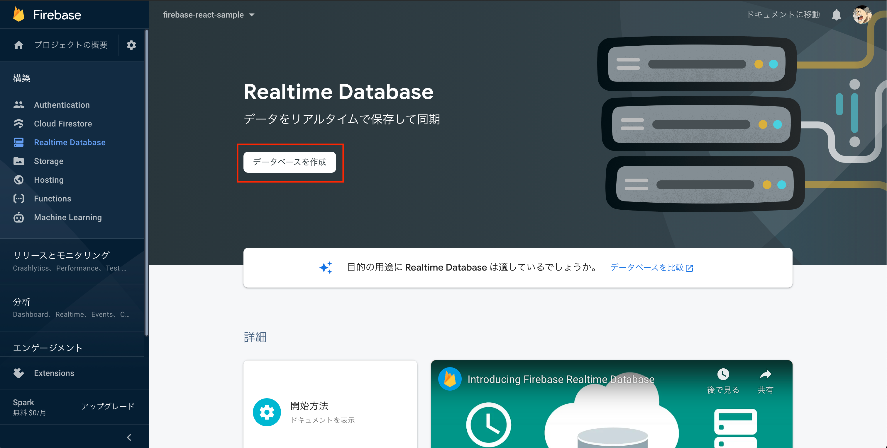

「米国」を選択し「次へ」を押下

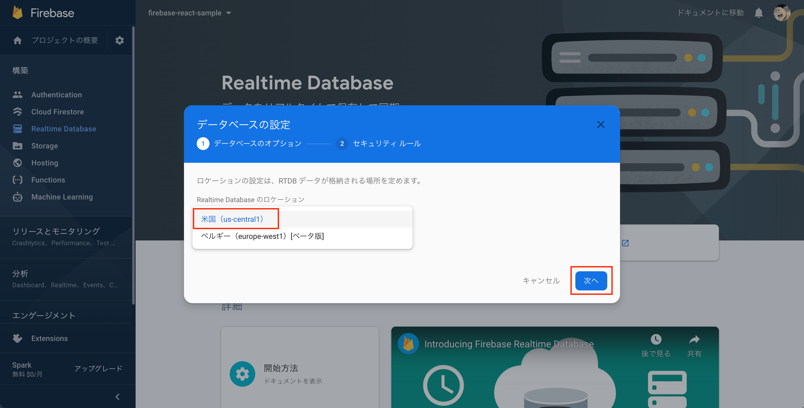

「テストモードで開始」を選択し「有効にする」を押下

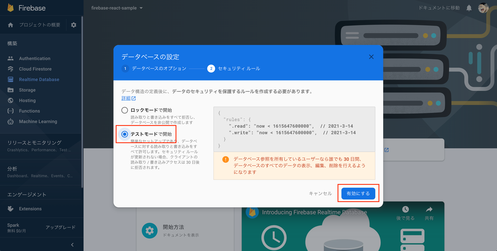

作成されたことを確認

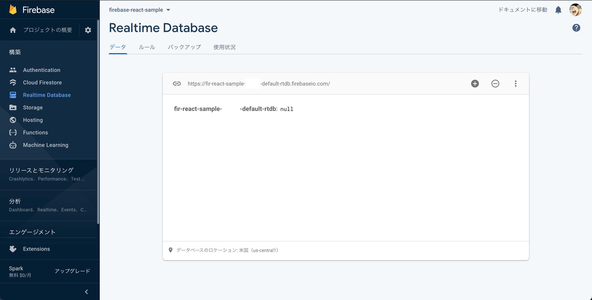

### 準備(Firebase Web App)

「プロジェクトの概要」を押下し、「</>」(Web)を押下


「アプリのニックネーム」を記載し「アプリを登録」を押下
(Firebase Hosting の設定はチェックしない)

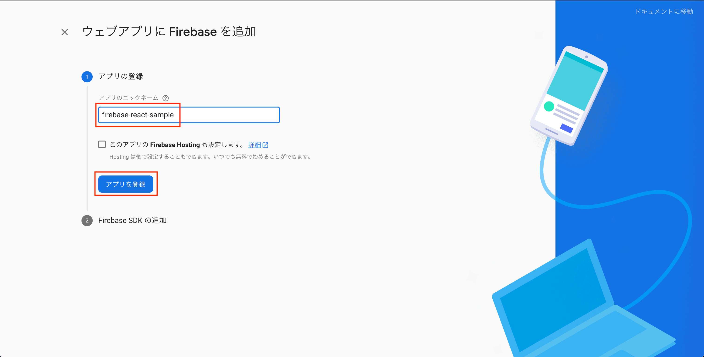

スクリプトをクリップボードにコピーし「コンソールに進む」を押下

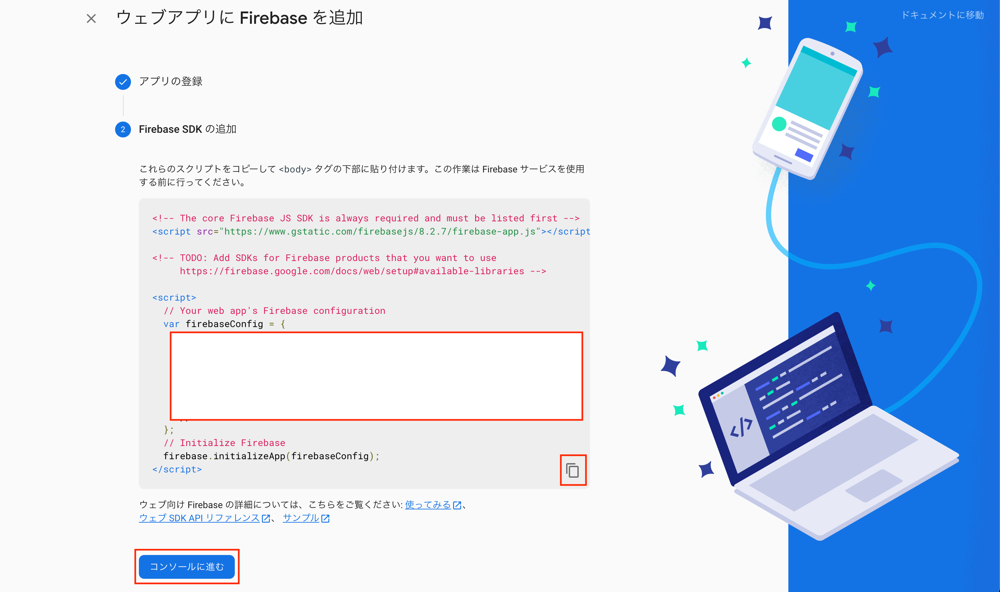

`.env.local`を作成しクリップボードにコピーした内容をペーストする(後ほど.gitignore に指定すること)

### 準備(React)

#### React ベースアプリの作成

`app`ディレクトリを作成し遷移後`create-react-app`で React ベースアプリを作成する

```
$ mkdir app
$ cd app
$ npx create-react-app .
```

#### React アプリの起動

`localhost:3000`で起動すること

```
$ yarn start
```

#### src 配下の変更

`src/components`ディレクトを作成する

#### App.js の修正

[`App.js`](./sample/src/components/App.js)を`src/components`に移動し変更する

#### index.js の修正

[`index.js`](./sample/src/index.js)を import している`App`を`components/App`にパスを修正しその他変更する

#### firebase モジュールのインストール

確認

```
$ npm info firebase
```

インストール

```
$ yarn add firebase
```

`yarn start`は Ctrl+C で停止し改めてスタートする

```
$ yarn start
```

#### `.evn.local`の移動

事前に作成した[`.evn.local`](./sample/.env.local)を`app`直下に配置する(sample は設定値は空のため適時埋めること)

```
$ vi ./.env.local .
```

#### `.env.local`の編集

`firebase.js`から`process.env`で取得するため以下の内容に修正する(シングルクォートの中は取得した値を記述する)

```
REACT_APP_FIREBASE_API_KEY=''
REACT_APP_FIREBASE_AUTH_DOMAIN=''
REACT_APP_FIREBASE_DATABASE_URL=''
REACT_APP_FIREBASE_PROJECT_ID=''
REACT_APP_FIREBASE_STORAGE_BUCKET=''
REACT_APP_FIREBASE_MESSAGING_SENDER_ID=''
REACT_APP_FIREBASE_APP_ID=''
```

### 開発

#### firbase.js

[Firebase:read-and-write](https://firebase.google.com/docs/database/web/read-and-write)

`src`直下に[`firebase.js`](./sample/src/firebase.js)として作成

#### メッセージデータの投稿

`App.js`を以下に修正(空文字対応、エンター受付(全角、半角)、フォーカス固定などは行っていない)

```
import React, { useState } from "react"
import { pushMessage } from "../firebase"

const App = () => {
  const [name, setName] = useState("default")
  const [text, setText] = useState("text")
  return (
    <>
      <input
        type="text"
        value={name}
        onChange={(e) => setName((name) => (name = e.target.value))}
      />
      <input
        type="text"
        value={text}
        onChange={(e) => setText((text) => (text = e.target.value))}
      />
      <button onClick={() => pushMessage({ name: name, text: text })}>
        {" "}
        push{" "}
      </button>
    </>
  )
}

export default App

```

#### メッセージデータの取得(からの表示)

`App.js`を以下に修正

[公式:listen_for_value_events](https://firebase.google.com/docs/database/web/read-and-write#listen_for_value_events)

```
import React, { useState, useEffect } from "react"
import { messagesRef, pushMessage } from "../firebase"

const App = () => {
  const [name, setName] = useState("default")
  const [text, setText] = useState("text")
  const [messages, setMessages] = useState([])

  useEffect(() => {
    messagesRef
      .orderByKey()
      .limitToLast(10)
      .on("value", (snapshot) => {
        const messages = snapshot.val()
        if (messages === null) return
        const entries = Object.entries(messages)
        const newMessages = entries.map((data) => {
          const [key, message] = data
          return { key, ...message }
        })
        setMessages(newMessages)
      })
  }, [])

  return (
    <>
      {messages.map((message) => (
        <div key={message.key}>
          {message.name}:{message.text}
        </div>
      ))}
      <input
        type="text"
        value={name}
        onChange={(e) => setName((name) => (name = e.target.value))}
      />
      <input
        type="text"
        value={text}
        onChange={(e) => setText((text) => (text = e.target.value))}
      />
      <button onClick={() => pushMessage({ name: name, text: text })}>
        {" "}
        push{" "}
      </button>
    </>
  )
}

export default App
```

### 確認

Chrome DevTools を開き API キーで検索してみましょう

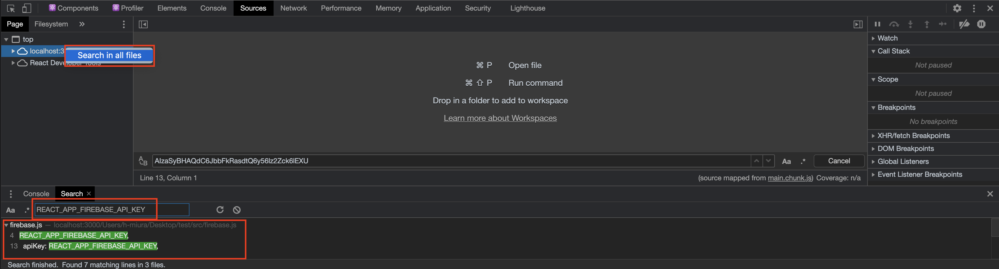
