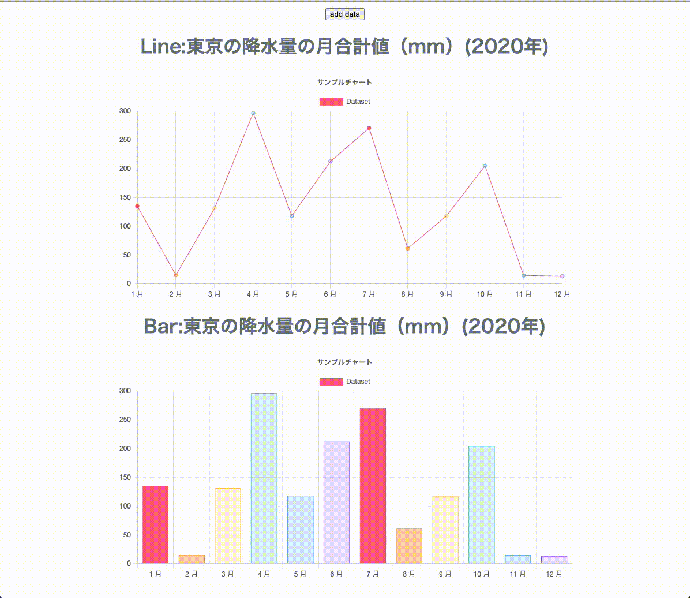

# react-chart

[Chart.js 公式](https://www.chartjs.org/)
[eact-chartjs-2 GitHub](https://github.com/reactchartjs/react-chartjs-2)

React で`react-chartjs-2`,`chart.js`を用いたグラフ描写



## SetUp

```
yarn install
```

## Memo

```
yarn add react-chartjs-2 chart.js
```
