# firebase-react-sample

## すること

1. React アプリから Firebase Realtime Database を利用  
   1-1. Firebase GUI にてアプリの登録  
   1-2. Firebase GUI にて Realtime Database の設定  
   1-3. Firebase GUI にて Hosting の設定  
   1-4. React にて Firebase Realtime Database と連携し簡単なチャットアプリの実装
2. 1.で作成したアプリを Firebase Hosting にデプロイ  
   2-1. GitHub Actions から Firebase Hosting にデプロイ  
   2-2. Firebase Cli から Firebase Hosting にデプロイ

## 前提

- [Firebase:](https://firebase.google.com/)を利用するため Gooble アカウントを所有していること

- React アプリが構築できること(参考 node.js,npm,yarn のバージョン)
  ```
  $ node -v
  v16.2.0
  $ npm -v
  7.19.1
  $ yarn -v
  1.22.10
  $ npx -v
  7.19.1
  ```

## 公式ドキュメント

今回利用する Firebase の API キーについては公式のドキュメントを一読推奨

[Learn about using and managing API keys for Firebase](https://firebase.google.com/docs/projects/api-keys)

## 1. Firebase Realtime Database

### 準備(Firebase Realtime Database)

[Firebase](https://firebase.google.com/)を開き「コンソールへ移動」を押下


「プロジェクトを追加」を押下

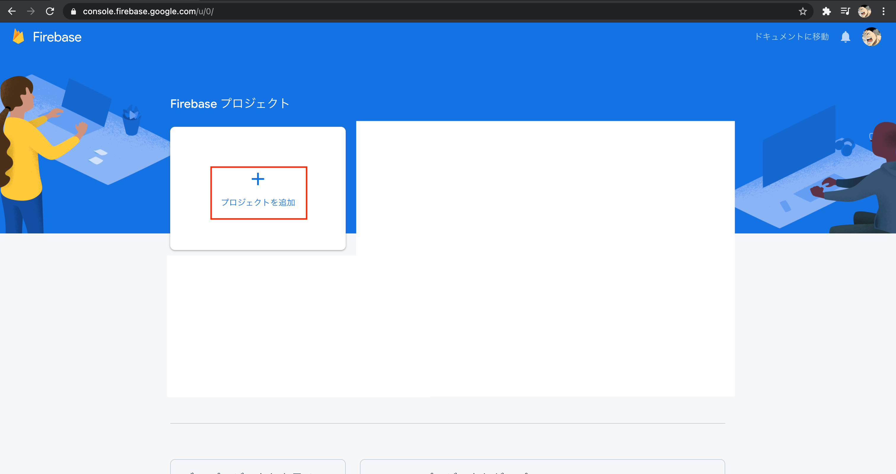

「プロジェクト名」を入力し「続行」を押下

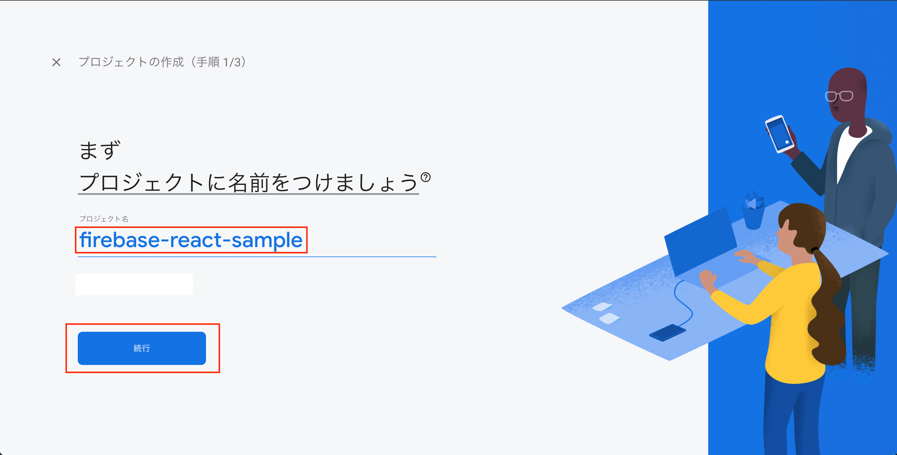

「アナリティクス」を無効(今回はサンプルコードのため)にし「プロジェクトを作成」を押下

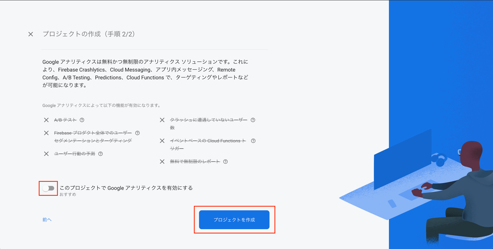

「続行」を押下


「Realtime Database」を押下


「データベースを作成」を押下

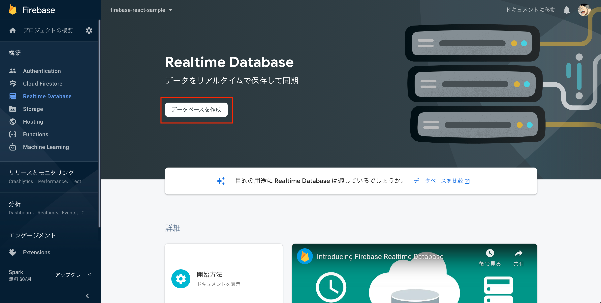

「米国」を選択し「次へ」を押下

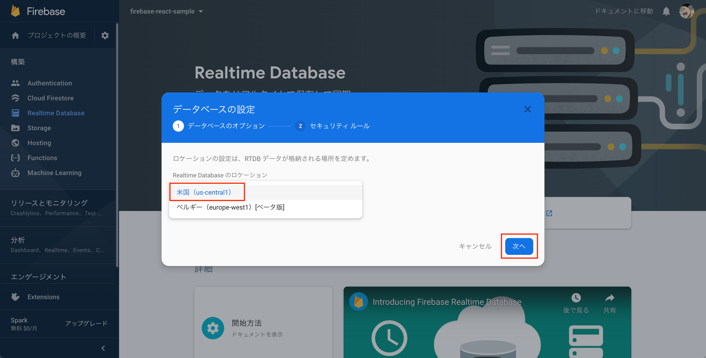

「テストモードで開始」を選択し「有効にする」を押下

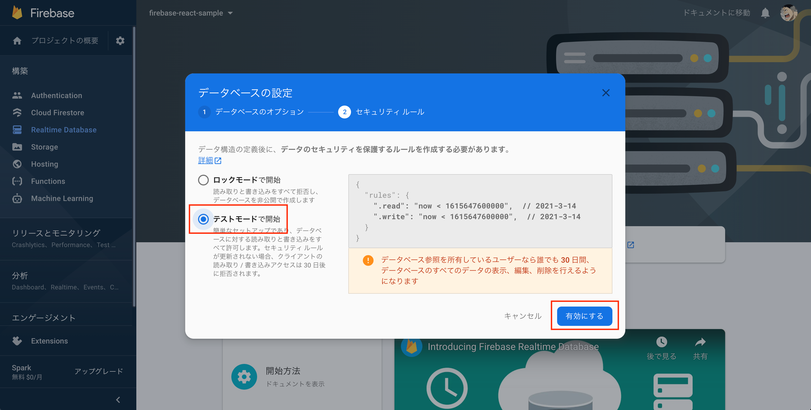

作成されたことを確認

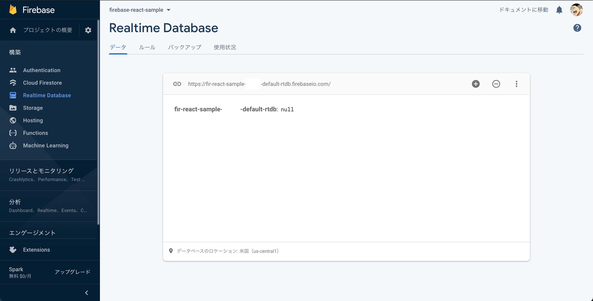

### 準備(Firebase Web App)

「プロジェクトの概要」を押下し、「</>」(Web)を押下


「アプリのニックネーム」を記載し「アプリを登録」を押下
(Firebase Hosting の設定はチェックしない)

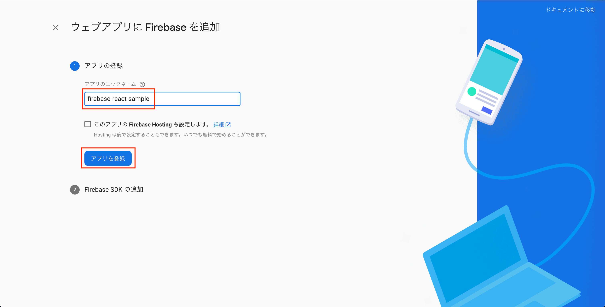

スクリプトをクリップボードにコピーし「コンソールに進む」を押下(`npm install firebase`は`react`の環境を構築後に行う)

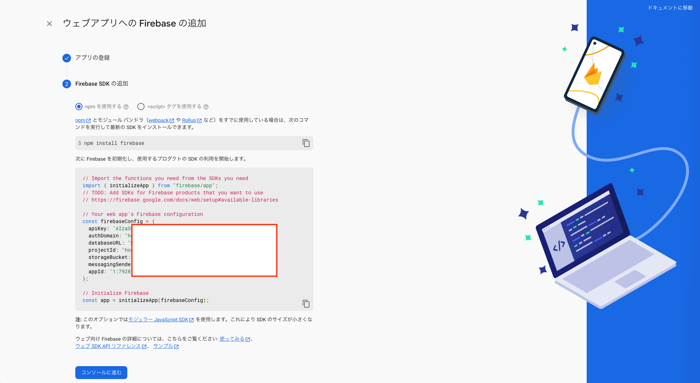

一時的なファイルを作成しクリップボードにコピーした内容をペーストする

### 準備(React)

#### React ベースアプリの作成

任意のディレクトリ（プロジェクト名と合わせる場合は`firebase-react-sample`)を作成し遷移後`create-react-app`で React ベースアプリを作成する

```
$ mkdir firebase-react-sample
$ cd firebase-react-sample
$ npx create-react-app .
```

一時的に退避したファイルを`.env.local`として作成しクリップボードにコピーした内容をペーストする(除外指定されていない場合は後ほど.gitignore に指定すること)

#### React アプリの起動

`localhost:3000`で起動すること

```
$ yarn start
```

#### src 配下の変更

`src/components`ディレクトを作成する

#### App.js の修正

[`App.js`](./sample/src/components/App.js)を`src/components`に移動し以下に変更する

```
import React from "react"

const App = () => {
  return <div>hello</div>
}

export default App
```

#### index.js の修正

[`index.js`](./sample/src/index.js)を import している`App`を`components/App`にパスを修正しその他以下に変更する

```
import React from "react"
import ReactDOM from "react-dom"
import App from "./components/App"

ReactDOM.render(
  <React.StrictMode>
    <App />
  </React.StrictMode>,
  document.getElementById("root")
)
```

ブラウザをリロードし`hello`が表示されていれば修正は成功

#### firebase モジュールのインストール

確認

```
$ yarn info firebase
```

インストール

```
$ yarn add firebase
```

`yarn start`は Ctrl+C で停止し改めてスタートする

```
$ yarn start
```

#### `.evn.local`の移動

事前に作成した[`.evn.local`](./sample/.env.local)を`app`直下に配置する(sample は設定値は空のため適時埋めること)

```
$ vi .env.local
```

#### `.env.local`の編集

`firebase.js`から`process.env`で取得するため以下の内容に修正する(シングルクォートの中は取得した値を記述する)

```
REACT_APP_FIREBASE_API_KEY=''
REACT_APP_FIREBASE_AUTH_DOMAIN=''
REACT_APP_FIREBASE_DATABASE_URL=''
REACT_APP_FIREBASE_PROJECT_ID=''
REACT_APP_FIREBASE_STORAGE_BUCKET=''
REACT_APP_FIREBASE_MESSAGING_SENDER_ID=''
REACT_APP_FIREBASE_APP_ID=''
```

### 開発

#### firbase.js

[参考公式：Firebase:read-and-write](https://firebase.google.com/docs/database/web/read-and-write)

`src`直下に[`firebase.js`](./sample/src/firebase.js)として作成

```
import firebase from 'firebase/compat/app'
import 'firebase/compat/database'

const {
  REACT_APP_FIREBASE_API_KEY,
  REACT_APP_FIREBASE_AUTH_DOMAIN,
  REACT_APP_FIREBASE_DATABASE_URL,
  REACT_APP_FIREBASE_PROJECT_ID,
  REACT_APP_FIREBASE_STORAGE_BUCKET,
  REACT_APP_FIREBASE_MESSAGING_SENDER_ID,
  REACT_APP_FIREBASE_APP_ID,
} = process.env

const firebaseConfig = {
  apiKey: REACT_APP_FIREBASE_API_KEY,
  authDomain: REACT_APP_FIREBASE_AUTH_DOMAIN,
  databaseURL: REACT_APP_FIREBASE_DATABASE_URL,
  projectId: REACT_APP_FIREBASE_PROJECT_ID,
  storageBucket: REACT_APP_FIREBASE_STORAGE_BUCKET,
  messagingSenderId: REACT_APP_FIREBASE_MESSAGING_SENDER_ID,
  appId: REACT_APP_FIREBASE_APP_ID,
}

firebase.initializeApp(firebaseConfig)
const database = firebase.database()
export const messagesRef = database.ref('messages')

export const pushMessage = ({ name, text }) => {
  messagesRef.push({ name, text })
}
```

`.env.local`を反映させるため、Ctrl+C で停止し改めて`yarn start`でスタートする

```
$ yarn start
```

#### メッセージデータの投稿

`App.js`を以下に修正(空文字対応、エンター受付(全角、半角)、フォーカス固定などは行っていない)

```
import React, { useState } from "react"
import { pushMessage } from "../firebase"

const App = () => {
  const [name, setName] = useState("default")
  const [text, setText] = useState("text")
  return (
    <>
      <input
        type="text"
        value={name}
        onChange={(e) => setName((name) => (name = e.target.value))}
      />
      <input
        type="text"
        value={text}
        onChange={(e) => setText((text) => (text = e.target.value))}
      />
      <button onClick={() => pushMessage({ name: name, text: text })}>
        {" "}
        push{" "}
      </button>
    </>
  )
}

export default App

```

#### メッセージデータの取得(からの表示)

`App.js`を以下に修正

[公式:listen_for_value_events](https://firebase.google.com/docs/database/web/read-and-write#listen_for_value_events)

```
import React, { useState, useEffect } from "react"
import { messagesRef, pushMessage } from "../firebase"

const App = () => {
  const [name, setName] = useState("default")
  const [text, setText] = useState("text")
  const [messages, setMessages] = useState([])

  useEffect(() => {
    messagesRef
      .orderByKey()
      .limitToLast(10)
      .on("value", (snapshot) => {
        const messages = snapshot.val()
        if (messages === null) return
        const entries = Object.entries(messages)
        const newMessages = entries.map((data) => {
          const [key, message] = data
          return { key, ...message }
        })
        setMessages(newMessages)
      })
  }, [])

  return (
    <>
      {messages.map((message) => (
        <div key={message.key}>
          {message.name}:{message.text}
        </div>
      ))}
      <input
        type="text"
        value={name}
        onChange={(e) => setName((name) => (name = e.target.value))}
      />
      <input
        type="text"
        value={text}
        onChange={(e) => setText((text) => (text = e.target.value))}
      />
      <button onClick={() => pushMessage({ name: name, text: text })}>
        {" "}
        push{" "}
      </button>
    </>
  )
}

export default App
```

### 確認

Chrome DevTools を開き`Sources`->`localhost:3000`を右クリックし API キー(`REACT_APP_FIREBASE_API_KEY`)で検索してみましょう

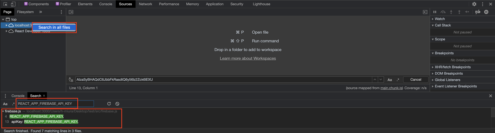

## デプロイ

### ビルド

```
$ yarn build
✨  Done in 10.65s.
```

`build`ディクレトリが作成されていることを確認

```
$ ll build
total 80
drwxr-xr-x  10 h-miura  staff   320  2 18 16:13 .
drwxr-xr-x  15 h-miura  staff   480  2 18 16:21 ..
-rw-r--r--   1 h-miura  staff   683  2 18 16:13 asset-manifest.json
-rw-r--r--   1 h-miura  staff  3870  2 18 16:13 favicon.ico
-rw-r--r--   1 h-miura  staff  2143  2 18 16:13 index.html
-rw-r--r--   1 h-miura  staff  5347  2 18 16:13 logo192.png
-rw-r--r--   1 h-miura  staff  9664  2 18 16:13 logo512.png
-rw-r--r--   1 h-miura  staff   492  2 18 16:13 manifest.json
-rw-r--r--   1 h-miura  staff    67  2 18 16:13 robots.txt
drwxr-xr-x   3 h-miura  staff    96  2 18 16:13 static
```

`build`ディレクトリに遷移し`http-server`でアプリを起動しブラウザで`http://127.0.0.1:8080`を開き動作確認を行う。(停止は CTRL+C)

```
$ cd build
$ npx http-server
npx: 23個のパッケージを2.34秒でインストールしました。
Starting up http-server, serving ./
Available on:
  http://127.0.0.1:8080
  http://192.168.1.12:8080
  http://192.168.1.14:8080
Hit CTRL-C to stop the server
```

CTRL-C で停止しアプリのホームディレクトリに戻る

```
$ cd ..
```

### GitHub レポ

(この章は GitHub で管理、デプロイする際に必要な手順です、GitHub にて管理やデプロイしない場合は不要です)

GitHub にて今回用のリポジトリを作成する`New repository`を押下

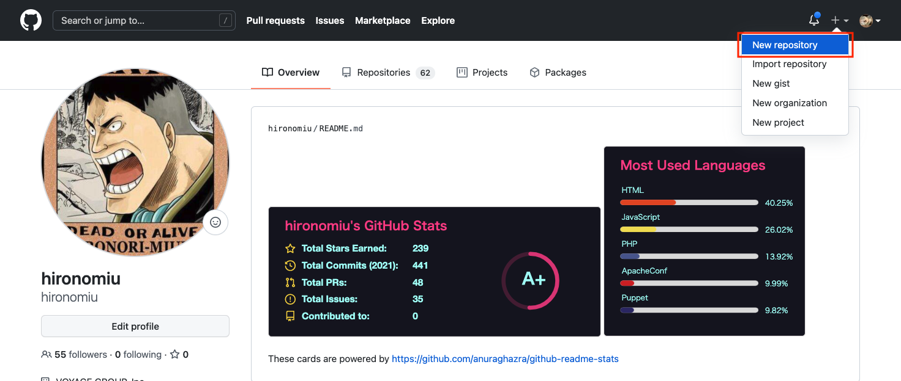

`Repository name`を記入し`Create repository`を押下

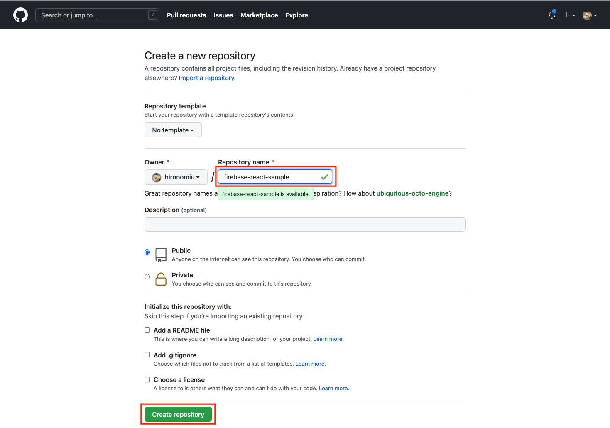

利用するプロトコルの選択し下部赤枠をコピーし実行する

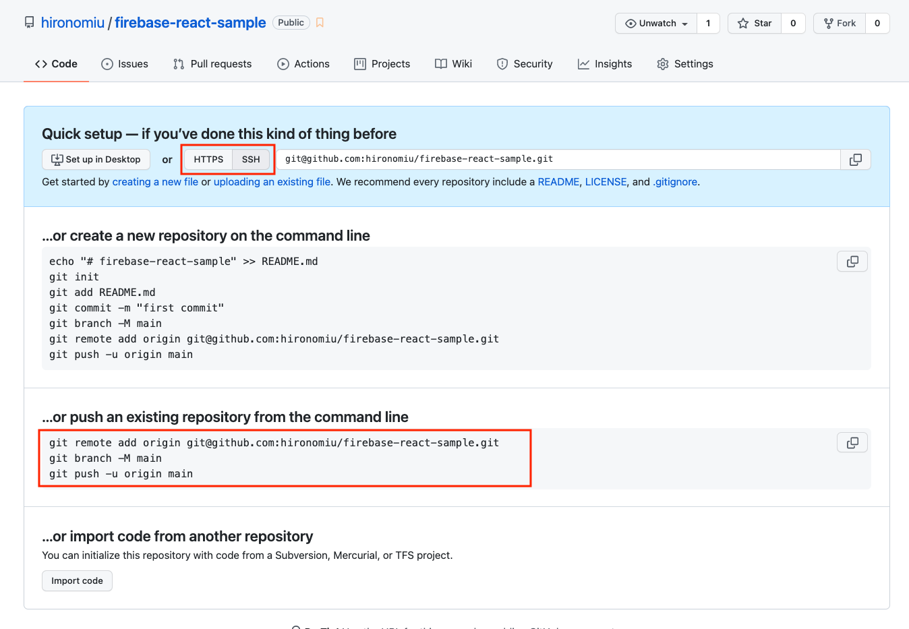

```
git remote add origin git@github.com:hironomiu/firebase-react-sample.git
git branch -M main
git push -u origin main
```

今回のアプリケーションを GitHub に push する

```
git add .
git commit -m "commited"
git push origin main
```

### Firebase Hosting

「Hosting」を押下


「始める」を押下


ローカルインストール

```

$ yarn add --dev firebase-tools

```

確認

```

$ npx firebase -V
9.18.0

```

「次へ」を押下

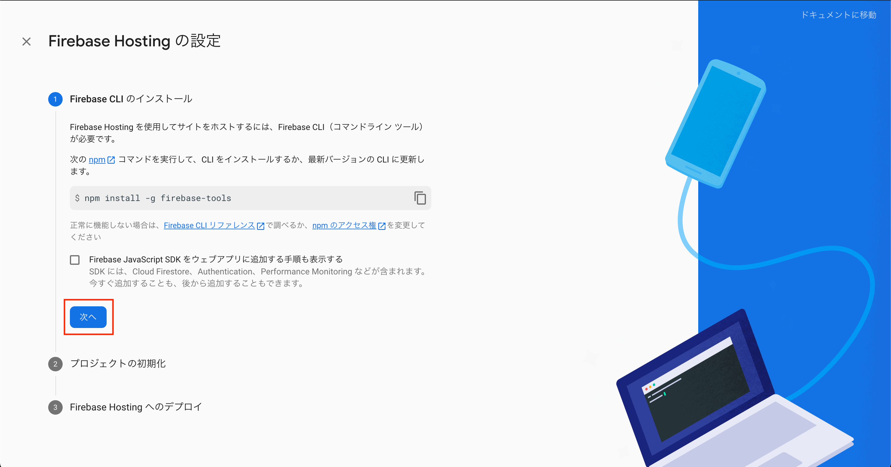

ローカルインストールのため`npx`をつけ実行する

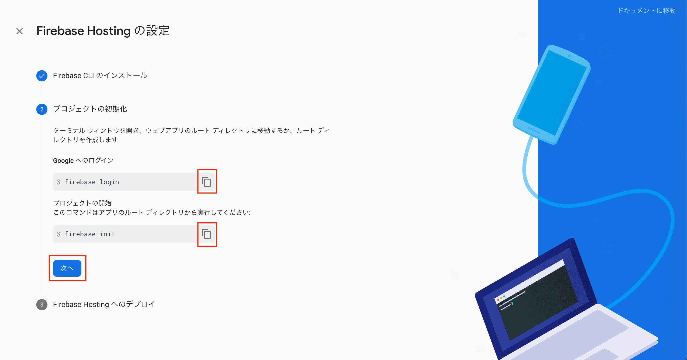

```

$ npx firebase login
Already logged in as xxxxx@gmail.com

```

矢印などで上下させ「Hosting: Configure」をを選択しスペースを押下しエンターを押下

```

$ npx firebase init

######## #### ######## ######## ######## ### ###### ######## ## ## ## ## ## ## ## ## ## ## ## ###### ## ######## ###### ######## ######### ###### ###### ## ## ## ## ## ## ## ## ## ## ## ## #### ## ## ######## ######## ## ## ###### ########
You're about to initialize a Firebase project in this directory:
/Users/Desktop/test
? Which Firebase CLI features do you want to set up for this folder? Press Space to select featur
es, then Enter to confirm your choices. (Press <space> to select, <a> to toggle all, <i> to inver
t selection)
◯ Database: Configure Firebase Realtime Database and deploy rules
◯ Firestore: Deploy rules and create indexes for Firestore
◯ Functions: Configure and deploy Cloud Functions
❯◯ Hosting: Configure and deploy Firebase Hosting sites
◯ Storage: Deploy Cloud Storage security rules
◯ Emulators: Set up local emulators for Firebase features
◯ Remote Config: Get, deploy, and rollback configurations for Remote Config
```

「Use an existing project」を選択しエンターを押下

```

=== Project Setup
First, let's associate this project directory with a Firebase project.
You can create multiple project aliases by running firebase use --add,
but for now we'll just set up a default project.
? Please select an option: (Use arrow keys)
❯ Use an existing project
Create a new project
Add Firebase to an existing Google Cloud Platform project
Don't set up a default project

```

今回作成したプロジェクトを選択しエンターを押下

```

=== Project Setup
First, let's associate this project directory with a Firebase project.
You can create multiple project aliases by running firebase use --add,
but for now we'll just set up a default project.
? Please select an option: Use an existing project
? Select a default Firebase project for this directory: (Use arrow keys)
❯ fir-react-sample (firebase-react-sample)
xxxxxx (xxxxxx)
yyyyyy (yyyyyy)

```

リポジトリの選択

```
Waiting for authentication...

✔  Success! Logged into GitHub as hironomiu

? For which GitHub repository would you like to set up a GitHub workflow? (format: user/repository) (hironomiu/firebase-react-sample)
```

`build`を入力しエンターを押下

```

=== Hosting Setup
Your public directory is the folder (relative to your project directory) that
will contain Hosting assets to be uploaded with firebase deploy. If you
have a build process for your assets, use your build's output directory.
? What do you want to use as your public directory? build

```

「y」を押下

```

? Configure as a single-page app (rewrite all urls to /index.html)? Yes

```

「y」を押下(GitHub)

```

? Set up automatic builds and deploys with GitHub? Yes

```

「n」を押下

```

? File build/index.html already exists. Overwrite? No
i Skipping write of build/index.html
i Writing configuration info to firebase.json...
i Writing project information to .firebaserc...
✔ Firebase initialization complete!

```

`Firebase CLI GitHub Login Successful` が表示されること


エンターを押下

```
? For which GitHub repository would you like to set up a GitHub workflow? (format: user/repository) hironomiu/firebase-react-sample
```

y を押下

```
? Set up the workflow to run a build script before every deploy? Yes
```

`yarn build`を記入

```
? What script should be run before every deploy? yarn build
```

y を押下

```
? Set up automatic deployment to your site's live channel when a PR is merged? Yes
```

`main`を選択

```
? What is the name of the GitHub branch associated with your site's live channel? main
```

`firebase.json`を確認

```

{
  "hosting": {
    "public": "build",
    "ignore": [
      "firebase.json",
      "**/.*",
      "**/node_modules/**"
    ],
    "rewrites": [
      {
        "source": "**",
        "destination": "/index.html"
      }
    ]
  }
}

```

`.firebaserc`を確認

```

{
  "projects": {
    "default": "fir-react-sample"
  }
}

```

「次へ」を押下


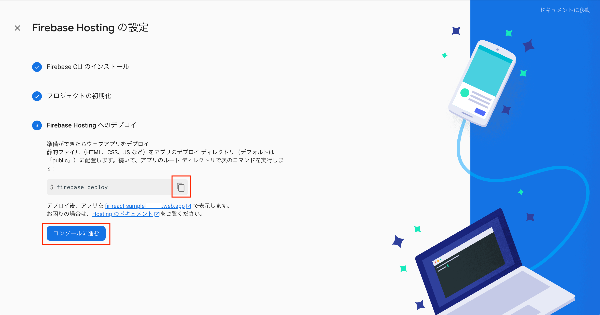

デプロイが成功したら「Hosting URL」をブラウザで開く

```

$ npx firebase deploy
=== Deploying to ‘fir-react-sample’...

i deploying hosting
i hosting[fir-react-sample]: beginning deploy...
i hosting[fir-react-sample]: found 14 files in build
✔ hosting[fir-react-sample]: file upload complete
i hosting[fir-react-sample]: finalizing version...
✔ hosting[fir-react-sample]: version finalized
i hosting[fir-react-sample]: releasing new version...
✔ hosting[fir-react-sample]: release complete
✔ Deploy complete!

Project Console: https://console.firebase.google.com/project/fir-react-sample-xxxx/overview
Hosting URL: https://fir-react-sample-xxxx.web.app

```

「コンソールにすすむ」を押下


ブラウザにて Hosting に設定されているドメインをクリックしアプリが動作することを確認する

ここまでに作成されたファイルを add,commit し push する

```
git add .
git commit -m "commited"
git push origin main
```

`yarn build`では GitHub Actions がエラーになる場合`.github/workflows/firebase-hosting-merge.yml`,`.github/workflows/firebase-hosting-pull-request.yml`の`- run: yarn build`の前に`- run: yarn add react-scripts`を追記する

```
      - run: yarn add react-scripts
      - run: yarn build
```

Secrets の設定を`.github/workflows/firebase-hosting-merge.yml`,`.github/workflows/firebase-hosting-pull-request.yml`の`jobs:`の上に以下を追記する

```
env:
  REACT_APP_FIREBASE_API_KEY: ${{secrets.REACT_APP_FIREBASE_API_KEY}}
  REACT_APP_FIREBASE_AUTH_DOMAIN: ${{secrets.REACT_APP_FIREBASE_AUTH_DOMAIN}}
  REACT_APP_FIREBASE_DATABASE_URL: ${{secrets.REACT_APP_FIREBASE_DATABASE_URL}}
  REACT_APP_FIREBASE_PROJECT_ID: ${{secrets.REACT_APP_FIREBASE_PROJECT_ID}}
  REACT_APP_FIREBASE_STORAGE_BUCKET: ${{secrets.REACT_APP_FIREBASE_STORAGE_BUCKET}}
  REACT_APP_FIREBASE_MESSAGING_SENDER_ID: ${{secrets.REACT_APP_FIREBASE_MESSAGING_SENDER_ID}}
  REACT_APP_FIREBASE_APP_ID: ${{secrets.REACT_APP_FIREBASE_APP_ID}}
```

GitHub リポジトリの`Settings` -> `Secrets`,`Actions` -> `New repository secret`を押下

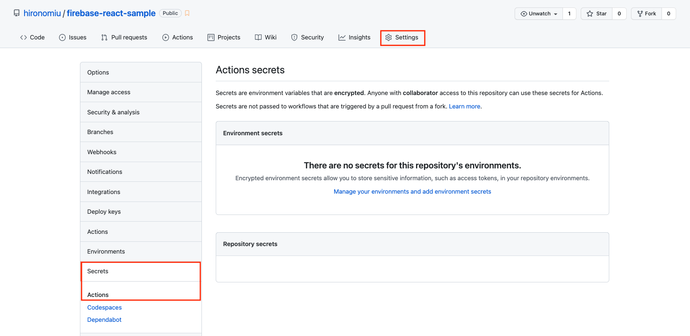

`.env.local`に設定した`REACT_APP_FIREBASE_API_KEY`から`REACT_APP_FIREBASE_APP_ID`を Name,Value に 1 つずつ設定し`Add secret`を押下

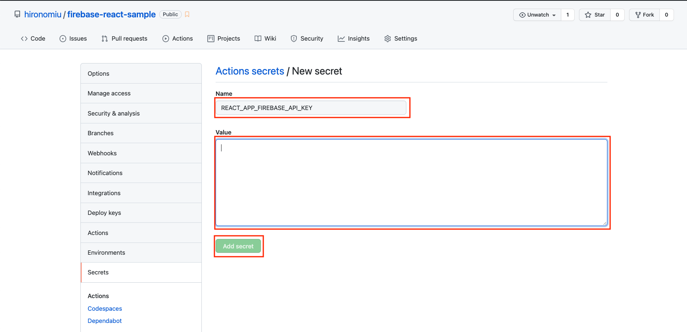

`add,commit,push`し GitHub Actions がグリーンとなること

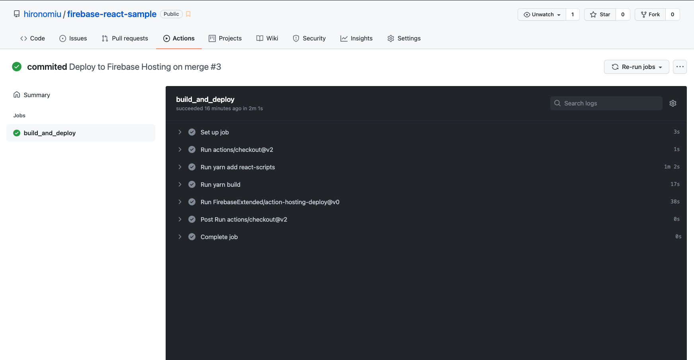

アプリを変更し`npx firebase deploy`や`git push`にて Hosting 先が変更されることを確認してみましょう
