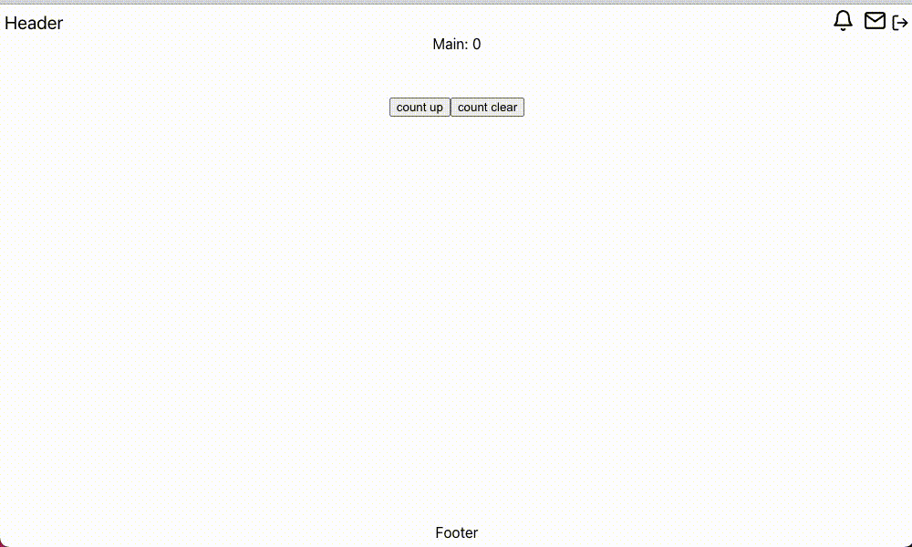

# react-notification-badge

通知バッジ（ベル、メール）の実装例



## SetUp

```
npm intall
```

## Run

```
npm start
```

## Build

```
npm run build
```

## Install Memo

```
npx create-react-app .
npm install react-icons
```
