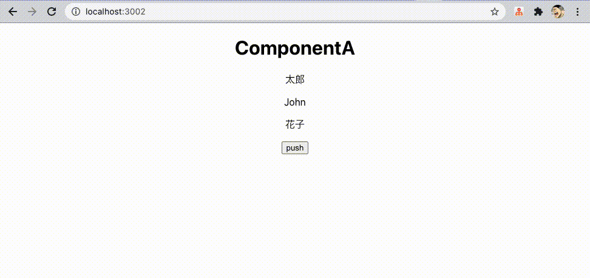

# react-query

react-query の実装サンプル

[公式](https://react-query.tanstack.com/)



## setup

```
yarn install
```

## app start

```
yarn start
```

## build

```
yarn build
```

## memo

一から構築メモ

```
npx create-react-app .
```

add modules

```
yarn add react-query
yarn add react-router-dom
```
