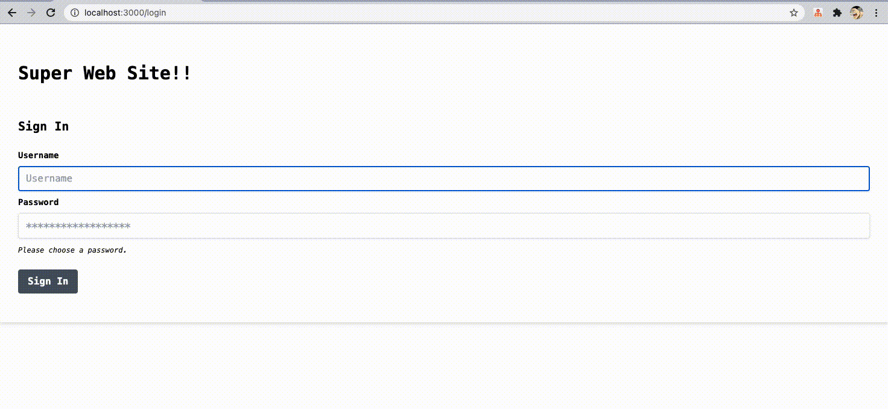

# react-router-context-sample

BrowserRouter,Context を使いグローバルでデータの保持、ログイン、画面遷移、ログアウトの簡単なサンプルアプリ(CSS は Tailwind を利用)



## SetUp

### React tailwind craco

`create-react-app`と必要なパッケージのインストール

```
npx create-react-app .
yarn add react-router-dom
yarn add -D tailwindcss@npm:@tailwindcss/postcss7-compat postcss@^7 autoprefixer@^9
yarn add @craco/craco
```

`package.json`の script を`craco`で構成する

before

```
    "start": "react-scripts start",
    "build": "react-scripts build",
    "test": "react-scripts test",
```

after(`eject`は削除)

```
    "start": "craco start",
    "build": "craco build",
    "test": "craco test"
```

`craco.config.js`を作成（`touch`ではなく VSCode からファイル作成でも良い）

```
touch craco.config.js
```

作成した`craco.config.js`に以下を記述

```
module.exports = {
  style: {
    postcss: {
      plugins: [require('tailwindcss'), require('autoprefixer')],
    },
  },
}
```

### tailwind init

tailwind の初期化

```
npx tailwindcss init -p
```

`tailwind.config.js`の`purge`を修正

```

- purge: [],

+ purge: ['./src/**/*.{js,jsx,ts,tsx}', './public/index.html'],

```

`./src/index.css`を tailwind を利用する設定に修正（以下の 3 行に全てを書き換え）

```

@tailwind base;
@tailwind components;
@tailwind utilities;

```

### Modal

モーダル用のパッケージのインストール

`@headlessui/react`

```
yarn add @headlessui/react
```

### icon

アイコン用のパッケージのインストール

`@heroicons/react`

```
yarn add @heroicons/react
```

## 起動

テンプレートが動作することを確認

```
yarn start
```

## Step1

ゴール：`Layout`,`Login`の画面を作成し表示させる

`src/App.js`を一旦`hello`だけ表示させる

```
import React from 'react'

const App = () => {
  return <div>hello</div>
}

export default App
```

### context の作成

`src`配下に`context`ディレクトリを作成する

`src/context`配下に`StateProvider.js`を作成し`serviceName`を定義した以下を記述する

```
import { createContext, useContext } from 'react'

const StateContext = createContext({})

export const StateProvider = ({ children }) => {
  const serviceName = 'Super Web Site'

  return (
    <StateContext.Provider value={{ serviceName }}>
      {children}
    </StateContext.Provider>
  )
}

export const useStateContext = () => useContext(StateContext)
```

### Layout.js の作成

`src`配下に`components`ディレクトリを作成する

`src/components`配下に`Layout.js`を作成し`context`で定義した`serviceName`を表示する以下を記述する

```
import React from 'react'
import { useStateContext } from '../context/StateProvider'

const Layout = ({ children }) => {
  const { serviceName } = useStateContext()

  return <div>{serviceName}</div>
}

export default Layout
```

### App.js の修正

`App.js`に`context`,`Layout`を組み込み画面に`Super Web Site`を表示する

```
import React from 'react'
import { StateProvider } from './context/StateProvider'
import Layout from './components/Layout'

const App = () => {
  return (
    <div>
      <StateProvider>
        <Layout />
      </StateProvider>
    </div>
  )
}

export default App
```

### Login.js の作成

ログインフォームは tailwindcomponents の[Login form](https://tailwindcomponents.com/component/login-form)を参考に作成

`src/components`配下に`Login.js`を作成

```
import React from 'react'

const Login = () => {
  return (
    <div>
      <div className="">
        <h1 className="">Supre Web Site!!</h1>
        <h1 className="">Login</h1>
        <div className="">
          <label htmlFor="username" className="">
            username
          </label>
          <input
            type="text"
            id="username"
            placeholder="Username"
            autoFocus={true}
            className=""
          />
        </div>
        <div className="">
          <label htmlFor="password" className="">
            username
          </label>
          <input
            type="password"
            id="password"
            placeholder="******************"
            className=""
          />
          <p className="">Please choose a password.</p>
        </div>
        <div className="">
          <button type="button" className="">Login</button>
        </div>
      </div>
    </div>
  )
}

export default Login

```

`Login.js`に CSS(`tailwind`)を当てていく

```
import React from 'react'

const Login = () => {
  return (
    <div>
      <div className="flex bg-white shadow-md rounded px-8 pt-6 pb-8 mb-4 flex-col font-mono">
        <h1 className="bg-white pt-10 pb-8 font-bold rounded text-3xl">
          Super Web Site!!"
        </h1>
        <h1 className="bg-white pt-6 pb-4 font-bold rounded text-xl">Login</h1>
        <div className="mb-4">
          <label
            htmlFor="username"
            className="block text-grey-darker pt-2 text-sm font-bold mb-2"
          >
            username
          </label>
          <input
            type="text"
            id="username"
            placeholder="Username"
            autoFocus={true}
            className="shadow appearance-none border rounded w-full py-2 px-3 text-grey-darker"
          />
        </div>
        <div className="mb-6">
          <label
            htmlFor="password"
            className="block text-grey-darker text-sm pt-2 font-bold mb-2"
          >
            username
          </label>
          <input
            type="password"
            id="password"
            placeholder="******************"
            className="shadow appearance-none border border-red rounded w-full py-2 px-3 text-grey-darker mb-3"
          />
          <p className="text-red text-xs italic">Please choose a password.</p>
        </div>
        <div className="flex items-center justify-between">
          <button
            type="button"
            className="bg-gray-600 hover:bg-blue-dark text-white font-bold py-2 px-4 rounded"
          >
        </div>
      </div>
    </div>
  )
}

export default Login

```

`App.js`に`Login`を import し`Login`,`Layout`を表示させる

```
import { StateProvider } from './context/StateProvider'
import Layout from './components/Layout'
import Login from './components/Login'

const App = () => {
  return (
    <div>
      <StateProvider>
        <Login />
        <Layout />
      </StateProvider>
    </div>
  )
}

export default App
```

## Step2

ゴール：ログインから Layout に遷移し、モーダルのログアウト画面からログアウト、キャンセルの実装をする

### context

`src/context/StateProvider.js`にログイン状態の State(`useState`の import,`isLogin,setIsLogin`の宣言,`StateContext.Provider`に設定) を設定する

```
import { createContext, useContext, useState } from 'react'

const StateContext = createContext({})

export const StateProvider = ({ children }) => {
  const serviceName = 'Super Web Site'
  const [isLogin, setIsLogin] = useState(false)

  return (
    <StateContext.Provider value={{ serviceName, isLogin, setIsLogin }}>
      {children}
    </StateContext.Provider>
  )
}

export const useStateContext = () => useContext(StateContext)
```

### App.js

`BrowserRouter, Route, Switch`を import しレイアウトを整える(一旦`Layout`を表示)

```
import React from 'react'
import { StateProvider } from './context/StateProvider'
import { BrowserRouter, Route, Switch } from 'react-router-dom'
import Layout from './components/Layout'
import Login from './components/Login'

const App = () => {
  return (
    <div>
      <BrowserRouter>
        <StateProvider>
          <Switch>
            <Route exact path="/login">
              <Login />
            </Route>
            <Layout></Layout>
          </Switch>
        </StateProvider>
      </BrowserRouter>
    </div>
  )
}

export default App
```

### Login.js

```
import React, { useEffect } from 'react'
import { useHistory } from 'react-router'
import { useStateContext } from '../context/StateProvider'

const Login = () => {
  const history = useHistory()
  const { isLogin, setIsLogin } = useStateContext()

  useEffect(() => {
    if (isLogin) {
      history.push('/')
    }
  })
  return (
    <div>
      <div className="flex bg-white shadow-md rounded px-8 pt-6 pb-8 mb-4 flex-col font-mono">
        <h1 className="bg-white pt-10 pb-8 font-bold rounded text-3xl">
          Super Web Site!!"
        </h1>
        <h1 className="bg-white pt-6 pb-4 font-bold rounded text-xl">Login</h1>
        <div className="mb-4">
          <label
            htmlFor="username"
            className="block text-grey-darker pt-2 text-sm font-bold mb-2"
          >
            username
          </label>
          <input
            type="text"
            id="username"
            placeholder="Username"
            autoFocus={true}
            className="shadow appearance-none border rounded w-full py-2 px-3 text-grey-darker"
          />
        </div>
        <div className="mb-6">
          <label
            htmlFor="password"
            className="block text-grey-darker text-sm pt-2 font-bold mb-2"
          >
            username
          </label>
          <input
            type="password"
            id="password"
            placeholder="******************"
            className="shadow appearance-none border border-red rounded w-full py-2 px-3 text-grey-darker mb-3"
          />
          <p className="text-red text-xs italic">Please choose a password.</p>
        </div>
        <div className="flex items-center justify-between">
          <button
            type="button"
            className="bg-gray-600 hover:bg-blue-dark text-white font-bold py-2 px-4 rounded"
          >
        </div>
      </div>
    </div>
  )
}

export default Login
```

### Layout.js

ログイン判定を実装し`/login`が表示されること

```
import React, { useEffect } from 'react'
import { useHistory } from 'react-router'
import { useStateContext } from '../context/StateProvider'

const Layout = ({ children }) => {
  const { serviceName, isLogin } = useStateContext()
  const history = useHistory()
  useEffect(() => {
    if (!isLogin) history.push('/login')
  })

  return <div>{serviceName}</div>
}

export default Layout
```

### Login.js(ログイン処理の実装)

`button`タグに`onClick`イベント処理を追記し`Login`ボタン押下後`/`に遷移すること

```
import React, { useEffect } from 'react'
import { useHistory } from 'react-router'
import { useStateContext } from '../context/StateProvider'

const Login = () => {
  const history = useHistory()
  const { isLogin, setIsLogin } = useStateContext()

  useEffect(() => {
    if (isLogin) {
      history.push('/')
    }
  })
  return (
    <div>
      <div className="flex bg-white shadow-md rounded px-8 pt-6 pb-8 mb-4 flex-col font-mono">
        <h1 className="bg-white pt-10 pb-8 font-bold rounded text-3xl">
          Super Web Site!!"
        </h1>
        <h1 className="bg-white pt-6 pb-4 font-bold rounded text-xl">Login</h1>
        <div className="mb-4">
          <label
            htmlFor="username"
            className="block text-grey-darker pt-2 text-sm font-bold mb-2"
          >
            username
          </label>
          <input
            type="text"
            id="username"
            placeholder="Username"
            autoFocus={true}
            className="shadow appearance-none border rounded w-full py-2 px-3 text-grey-darker"
          />
        </div>
        <div className="mb-6">
          <label
            htmlFor="password"
            className="block text-grey-darker text-sm pt-2 font-bold mb-2"
          >
            username
          </label>
          <input
            type="password"
            id="password"
            placeholder="******************"
            className="shadow appearance-none border border-red rounded w-full py-2 px-3 text-grey-darker mb-3"
          />
          <p className="text-red text-xs italic">Please choose a password.</p>
        </div>
        <div className="flex items-center justify-between">
          <button
            type="button"
            className="bg-gray-600 hover:bg-blue-dark text-white font-bold py-2 px-4 rounded"
            onClick={() => {
              setIsLogin(true)
              history.push('/')
            }}
          >
            Login
          </button>
        </div>
      </div>
    </div>
  )
}

export default Login
```

### Layout.js（レイアウトの実装１）

一旦 JSX 内のレイアウトを作成する

```
import React, { useEffect } from 'react'
import { useHistory } from 'react-router'
import { useStateContext } from '../context/StateProvider'
import { Link } from 'react-router-dom'
import { LogoutIcon } from '@heroicons/react/outline'

const Layout = ({ children }) => {
  const { serviceName, isLogin } = useStateContext()
  const history = useHistory()
  useEffect(() => {
    if (!isLogin) history.push('/login')
  })

  return (
    <div className="">
      <header className="">
        <nav className="">
          <div className="">
            <div className="">
              <span className="">
                {serviceName}!!
              </span>
              <Link className="">
                Root
              </Link>
              <Link className="">
                ComponentA
              </Link>
            </div>
            <div className="">
              <LogoutIcon className="" />
            </div>
          </div>
        </nav>
      </header>
      <main>{children}</main>
      <footer className="">
        <div className="">
          <p className="">{serviceName}@2021</p>
        </div>
      </footer>
    </div>
  )
}

export default Layout

```

### Layout.js（レイアウトの実装１）

CSS(tailwind)を適用する

```
import React, { useEffect } from 'react'
import { useHistory } from 'react-router'
import { useStateContext } from '../context/StateProvider'
import { Link } from 'react-router-dom'
import { LogoutIcon } from '@heroicons/react/outline'

const Layout = ({ children }) => {
  const { serviceName, isLogin } = useStateContext()
  const history = useHistory()
  useEffect(() => {
    if (!isLogin) history.push('/login')
  })

  return (
    <div className="flex items-center flex-col min-h-screen text-gray-600 font-mono">
      <header className="flex items-center pl-8 h-14 bg-gray-600 w-screen">
        <nav className="bg-gray-600 w-screen">
          <div className="flex justify-between">
            <div className="">
              <span className="font-semibold text-xl tracking-tight text-white">
                {serviceName}!!
              </span>
              <Link className="text-sm text-gray-200 hover:bg-gray-700 px-3 py-2 rounded">
                Root
              </Link>
              <Link className="text-sm text-gray-200 hover:bg-gray-700 px-3 py-2 rounded">
                ComponentA
              </Link>
            </div>
            <div className="">
              <LogoutIcon className="h-8 w-10 text-gray-200 hover:bg-gray-700 px-1 mr-5 rounded" />
            </div>
          </div>
        </nav>
      </header>
      <main>{children}</main>
      <footer className="bg-gray-400 w-screen absolute bottom-0 h-14">
        <div className="flex justify-center items-center">
          <p className="pt-3">{serviceName}@2021</p>
        </div>
      </footer>
    </div>
  )
}

export default Layout

```

### Modal.js(ログアウトモーダルの実装)

[tailwindui:Modals](https://tailwindui.com/components/application-ui/overlays/modals)を参考に実装

```
import { Fragment, useRef, useState } from 'react'
import { Dialog, Transition } from '@headlessui/react'
import { LogoutIcon } from '@heroicons/react/outline'
import { useStateContext } from '../context/StateProvider'

const Modal = ({ setModalOn }) => {
  const [open, setOpen] = useState(true)
  const { setIsLogin } = useStateContext()
  const cancelButtonRef = useRef(null)

  return (
    <Transition.Root show={open} as={Fragment}>
      <Dialog
        as="div"
        className="fixed z-10 inset-0 overflow-y-auto font-mono"
        initialFocus={cancelButtonRef}
        onClose={() => {
          setOpen(false)
          setModalOn(false)
        }}
      >
        <div className="flex items-end justify-center min-h-screen pt-4 px-4 pb-20 text-center sm:block sm:p-0">
          <Transition.Child
            as={Fragment}
            enter="ease-out duration-300"
            enterFrom="opacity-0"
            enterTo="opacity-100"
            leave="ease-in duration-200"
            leaveFrom="opacity-100"
            leaveTo="opacity-0"
          >
            <Dialog.Overlay className="fixed inset-0 bg-gray-500 bg-opacity-75 transition-opacity" />
          </Transition.Child>

          {/* This element is to trick the browser into centering the modal contents. */}
          <span
            className="hidden sm:inline-block sm:align-middle sm:h-screen"
            aria-hidden="true"
          >
            &#8203;
          </span>
          <Transition.Child
            as={Fragment}
            enter="ease-out duration-300"
            enterFrom="opacity-0 translate-y-4 sm:translate-y-0 sm:scale-95"
            enterTo="opacity-100 translate-y-0 sm:scale-100"
            leave="ease-in duration-200"
            leaveFrom="opacity-100 translate-y-0 sm:scale-100"
            leaveTo="opacity-0 translate-y-4 sm:translate-y-0 sm:scale-95"
          >
            <div className="inline-block align-bottom bg-white rounded-lg text-left overflow-hidden shadow-xl transform transition-all sm:my-8 sm:align-middle sm:max-w-lg sm:w-full">
              <div className="bg-white px-4 pt-5 pb-4 sm:p-6 sm:pb-4">
                <div className="sm:flex sm:items-start">
                  <div className="mx-auto flex-shrink-0 flex items-center justify-center h-12 w-12 rounded-full bg-gray-100 sm:mx-0 sm:h-10 sm:w-10">
                    <LogoutIcon
                      className="h-6 w-6 text-gray-600"
                      aria-hidden="true"
                    />
                  </div>
                  <div className="mt-3 text-center sm:mt-0 sm:ml-4 sm:text-left">
                    <Dialog.Title
                      as="h3"
                      className="text-lg leading-6 font-medium text-gray-900"
                    >
                      Logout account
                    </Dialog.Title>
                    <div className="mt-2">
                      <p className="text-sm text-gray-500">
                        ログアウトしますか？
                      </p>
                    </div>
                  </div>
                </div>
              </div>
              <div className="bg-gray-50 px-4 py-3 sm:px-6 sm:flex sm:flex-row-reverse">
                <button
                  type="button"
                  className="w-full inline-flex justify-center rounded-md border border-transparent shadow-sm px-4 py-2 bg-gray-500 text-base font-medium text-white hover:bg-gray-700 focus:outline-none focus:ring-2 focus:ring-offset-2 focus:ring-gray-500 sm:ml-3 sm:w-auto sm:text-sm"
                  onClick={() => {
                    setOpen(false)
                    setModalOn(false)
                    setIsLogin(false)
                  }}
                >
                  Logout
                </button>
                <button
                  type="button"
                  className="mt-3 w-full inline-flex justify-center rounded-md border border-gray-300 shadow-sm px-4 py-2 bg-white text-base font-medium text-gray-700 hover:bg-gray-50 focus:outline-none focus:ring-2 focus:ring-offset-2 focus:ring-indigo-500 sm:mt-0 sm:ml-3 sm:w-auto sm:text-sm"
                  onClick={() => {
                    setOpen(false)
                    setModalOn(false)
                  }}
                  ref={cancelButtonRef}
                >
                  Cancel
                </button>
              </div>
            </div>
          </Transition.Child>
        </div>
      </Dialog>
    </Transition.Root>
  )
}

export default Modal

```

### Layout.js(ログアウトモーダルの実装)

```
import React, { useState, useEffect } from 'react'
import { useHistory } from 'react-router'
import { useStateContext } from '../context/StateProvider'
import { Link } from 'react-router-dom'
import { LogoutIcon } from '@heroicons/react/outline'
import Modal from './Modal'

const Layout = ({ children }) => {
  const { serviceName, isLogin } = useStateContext()
  const history = useHistory()
  const [modalOn, setModalOn] = useState(false)

  useEffect(() => {
    if (!isLogin) history.push('/login')
  })

  return (
    <div className="flex items-center flex-col min-h-screen text-gray-600 font-mono">
      <header className="flex items-center pl-8 h-14 bg-gray-600 w-screen">
        <nav className="bg-gray-600 w-screen">
          <div className="flex justify-between">
            <div className="">
              <span className="font-semibold text-xl tracking-tight text-white">
                {serviceName}!!
              </span>
              <Link className="text-sm text-gray-200 hover:bg-gray-700 px-3 py-2 rounded">
                Root
              </Link>
              <Link className="text-sm text-gray-200 hover:bg-gray-700 px-3 py-2 rounded">
                ComponentA
              </Link>
            </div>
            <div className="">
              <LogoutIcon
                className="h-8 w-10 text-gray-200 hover:bg-gray-700 px-1 mr-5 rounded"
                aria-hidden="true"
                onClick={() => {
                  setModalOn(true)
                }}
              />
              {modalOn ? <Modal setModalOn={setModalOn} /> : null}
            </div>
          </div>
        </nav>
      </header>
      <main>{children}</main>
      <footer className="bg-gray-400 w-screen absolute bottom-0 h-14">
        <div className="flex justify-center items-center">
          <p className="pt-3">{serviceName}@2021</p>
        </div>
      </footer>
    </div>
  )
}

export default Layout

```

## Step3

ゴール：

### Root.js

`App`に`Layout`配下で組み込むコンポーネント`Root`を`src/components/Root.js`で一旦`hello`を表示するよう作成する

```
import React from 'react'

const Root = () => {
  return <div>Root</div>
}

export default Root
```

### App.js

`Root`を組み込む

```
import React from 'react'
import { StateProvider } from './context/StateProvider'
import { BrowserRouter, Route, Switch } from 'react-router-dom'
import Layout from './components/Layout'
import Login from './components/Login'
import Root from './components/Root'

const App = () => {
  return (
    <div>
      <BrowserRouter>
        <StateProvider>
          <Switch>
            <Route exact path="/login">
              <Login />
            </Route>
            <Layout>
                <Route exact path="/">
                  <Root />
                </Route>
            </Layout>
          </Switch>
        </StateProvider>
      </BrowserRouter>
    </div>
  )
}

export default App

```

### Layout.js

`Root`の`Link`に設定する(`to='/'`の追記のみ)

```
import React, { useState, useEffect } from 'react'
import { useHistory } from 'react-router'
import { useStateContext } from '../context/StateProvider'
import { Link } from 'react-router-dom'
import { LogoutIcon } from '@heroicons/react/outline'
import Modal from './Modal'

const Layout = ({ children }) => {
  const { serviceName, isLogin } = useStateContext()
  const history = useHistory()
  const [modalOn, setModalOn] = useState(false)

  useEffect(() => {
    if (!isLogin) history.push('/login')
  })

  return (
    <div className="flex items-center flex-col min-h-screen text-gray-600 font-mono">
      <header className="flex items-center pl-8 h-14 bg-gray-600 w-screen">
        <nav className="bg-gray-600 w-screen">
          <div className="flex justify-between">
            <div className="">
              <span className="font-semibold text-xl tracking-tight text-white">
                {serviceName}!!
              </span>
              <Link
                className="text-sm text-gray-200 hover:bg-gray-700 px-3 py-2 rounded"
                to="/"
              >
                Root
              </Link>
              <Link className="text-sm text-gray-200 hover:bg-gray-700 px-3 py-2 rounded">
                ComponentA
              </Link>
            </div>
            <div className="">
              <LogoutIcon
                className="h-8 w-10 text-gray-200 hover:bg-gray-700 px-1 mr-5 rounded"
                aria-hidden="true"
                onClick={() => {
                  setModalOn(true)
                }}
              />
              {modalOn ? <Modal setModalOn={setModalOn} /> : null}
            </div>
          </div>
        </nav>
      </header>
      <main>{children}</main>
      <footer className="bg-gray-400 w-screen absolute bottom-0 h-14">
        <div className="flex justify-center items-center">
          <p className="pt-3">{serviceName}@2021</p>
        </div>
      </footer>
    </div>
  )
}

export default Layout

```

### ComponentA.js

`src/components/ComponentA.js`を作成し一旦`ComponentA`を表示する

```
import React from 'react'

const ComponentA = () => {
  return <div>ComponentA</div>
}

export default ComponentA

```

### App.js

`ComponentA`を組み込む

```
import React from 'react'
import { StateProvider } from './context/StateProvider'
import { BrowserRouter, Route, Switch } from 'react-router-dom'
import Layout from './components/Layout'
import Login from './components/Login'
import Root from './components/Root'
import ComponentA from './components/ComponentA'

const App = () => {
  return (
    <div>
      <BrowserRouter>
        <StateProvider>
          <Switch>
            <Route exact path="/login">
              <Login />
            </Route>
            <Layout>
              <Route exact path="/">
                <Root />
              </Route>
              <Route exact path="/component-a">
                <ComponentA />
              </Route>
            </Layout>
          </Switch>
        </StateProvider>
      </BrowserRouter>
    </div>
  )
}

export default App

```

### Layout.js

`ComponentA`の`Link`に設定し(`to='/component-a'`を追記)、`Root`以外の Location の場合 Top に戻る Link を設定

```
import React, { useState, useEffect } from 'react'
import { useHistory, useLocation } from 'react-router'
import { useStateContext } from '../context/StateProvider'
import { Link } from 'react-router-dom'
import { LogoutIcon } from '@heroicons/react/outline'
import Modal from './Modal'

const Layout = ({ children }) => {
  const { serviceName, isLogin } = useStateContext()
  const history = useHistory()
  const location = useLocation()
  const [modalOn, setModalOn] = useState(false)

  useEffect(() => {
    if (!isLogin) history.push('/login')
  })

  return (
    <div className="flex items-center flex-col min-h-screen text-gray-600 font-mono">
      <header className="flex items-center pl-8 h-14 bg-gray-600 w-screen">
        <nav className="bg-gray-600 w-screen">
          <div className="flex justify-between">
            <div className="">
              <span className="font-semibold text-xl tracking-tight text-white">
                {serviceName}!!
              </span>
              <Link
                className="text-sm text-gray-200 hover:bg-gray-700 px-3 py-2 rounded"
                to="/"
              >
                Root
              </Link>
              <Link
                className="text-sm text-gray-200 hover:bg-gray-700 px-3 py-2 rounded"
                to="/component-a"
              >
                ComponentA
              </Link>
            </div>
            <div className="">
              <LogoutIcon
                className="h-8 w-10 text-gray-200 hover:bg-gray-700 px-1 mr-5 rounded"
                aria-hidden="true"
                onClick={() => {
                  setModalOn(true)
                }}
              />
              {modalOn ? <Modal setModalOn={setModalOn} /> : null}
            </div>
          </div>
        </nav>
      </header>
      <main>{children}</main>
      {location.pathname === '/' ? null : <Link to="/">Top</Link>}
      <footer className="bg-gray-400 w-screen absolute bottom-0 h-14">
        <div className="flex justify-center items-center">
          <p className="pt-3">{serviceName}@2021</p>
        </div>
      </footer>
    </div>
  )
}

export default Layout


```

## Available Scripts

In the project directory, you can run:

### `yarn start`

Runs the app in the development mode.\
Open [http://localhost:3000](http://localhost:3000) to view it in the browser.

The page will reload if you make edits.\
You will also see any lint errors in the console.

### `yarn test`

Launches the test runner in the interactive watch mode.\
See the section about [running tests](https://facebook.github.io/create-react-app/docs/running-tests) for more information.

### `yarn build`

Builds the app for production to the `build` folder.\
It correctly bundles React in production mode and optimizes the build for the best performance.

The build is minified and the filenames include the hashes.\
Your app is ready to be deployed!

See the section about [deployment](https://facebook.github.io/create-react-app/docs/deployment) for more information.

### `yarn eject`

**Note: this is a one-way operation. Once you `eject`, you can’t go back!**

If you aren’t satisfied with the build tool and configuration choices, you can `eject` at any time. This command will remove the single build dependency from your project.

Instead, it will copy all the configuration files and the transitive dependencies (webpack, Babel, ESLint, etc) right into your project so you have full control over them. All of the commands except `eject` will still work, but they will point to the copied scripts so you can tweak them. At this point you’re on your own.

You don’t have to ever use `eject`. The curated feature set is suitable for small and middle deployments, and you shouldn’t feel obligated to use this feature. However we understand that this tool wouldn’t be useful if you couldn’t customize it when you are ready for it.

## Learn More

You can learn more in the [Create React App documentation](https://facebook.github.io/create-react-app/docs/getting-started).

To learn React, check out the [React documentation](https://reactjs.org/).

### Code Splitting

This section has moved here: [https://facebook.github.io/create-react-app/docs/code-splitting](https://facebook.github.io/create-react-app/docs/code-splitting)

### Analyzing the Bundle Size

This section has moved here: [https://facebook.github.io/create-react-app/docs/analyzing-the-bundle-size](https://facebook.github.io/create-react-app/docs/analyzing-the-bundle-size)

### Making a Progressive Web App

This section has moved here: [https://facebook.github.io/create-react-app/docs/making-a-progressive-web-app](https://facebook.github.io/create-react-app/docs/making-a-progressive-web-app)

### Advanced Configuration

This section has moved here: [https://facebook.github.io/create-react-app/docs/advanced-configuration](https://facebook.github.io/create-react-app/docs/advanced-configuration)

### Deployment

This section has moved here: [https://facebook.github.io/create-react-app/docs/deployment](https://facebook.github.io/create-react-app/docs/deployment)

### `yarn build` fails to minify

This section has moved here: [https://facebook.github.io/create-react-app/docs/troubleshooting#npm-run-build-fails-to-minify](https://facebook.github.io/create-react-app/docs/troubleshooting#npm-run-build-fails-to-minify)

```

```

```

```
